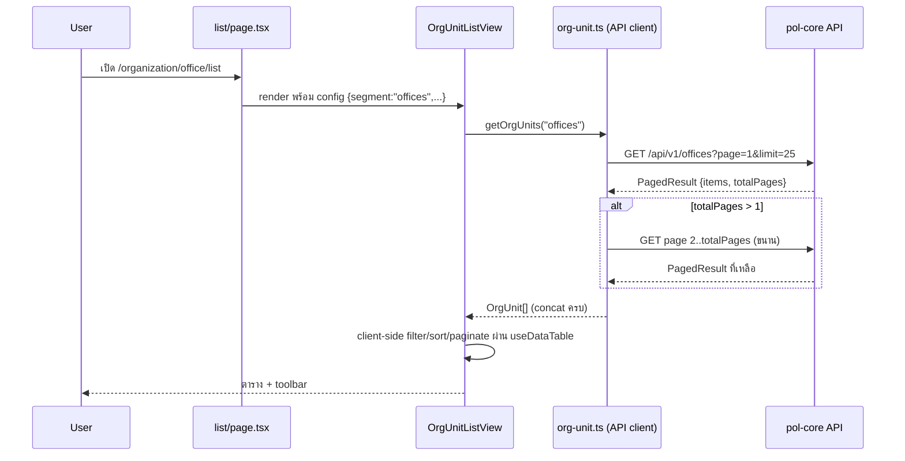
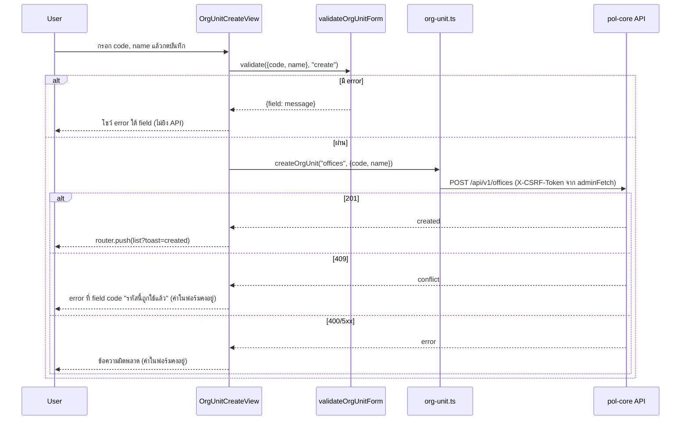
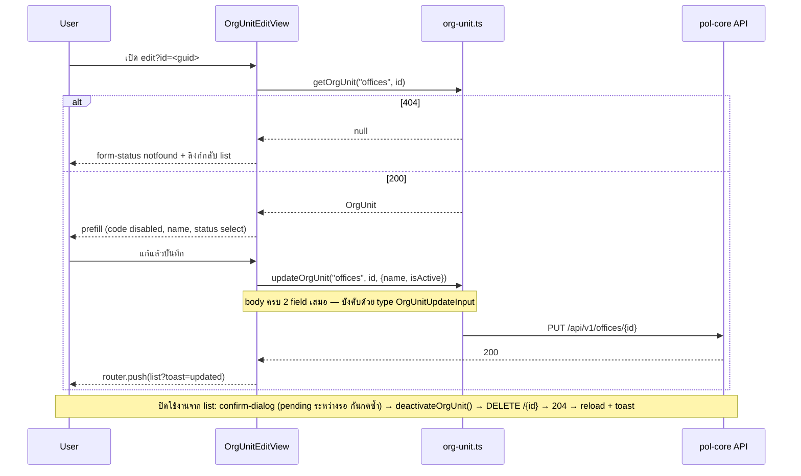

# Design: โมดูลโครงสร้างองค์กร (organization-structure)

> Status: approved 2026-08-02

## Architecture Overview

หลักการเดียวของ design นี้: **implementation ชุดเดียว parametrize ด้วย config ต่อ entity** (REQ-7.2)
เพราะทั้ง 4 resource มี schema/behavior เหมือนกัน 100% ต่างเฉพาะ label / path / API segment
ชั้น route ยังเป็น per-entity folder ตาม convention ของ repo — route file เป็นแค่เปลือกบางส่ง config
เข้า shared view

```
src/app/organization/                        (ชั้น route — per-entity, บางที่สุด)
  layout.tsx                                 ครอบ MinimalsLayout (แบบ src/app/merchant/layout.tsx)
  {office,division,position,level}/
    list/page.tsx                            metadata + PageHeader + <OrgUnitListView config>
    read/{page,layout}.tsx                   ?id= → <OrgUnitReadView config id>
    create/{page,layout}.tsx                 <OrgUnitCreateView config>
    edit/{page,layout}.tsx                   ?id= → <OrgUnitEditView config id>

src/components/organization/org-unit/        (ชั้น view — ชุดเดียวใช้ร่วม 4 module)
  view.tsx          list container: โหลดข้อมูล, state search/status/dense/detail/deactivate/toast
  toolbar.tsx       ช่องค้นหา + select สถานะ
  columns.tsx       buildOrgUnitColumns(): checkbox, code, name, status badge, actions
  status-badge.tsx  badge ใช้งาน/ปิดใช้งาน + STATUS_OPTIONS (single source)
  detail-sheet.tsx  drawer รายละเอียดจาก row click
  confirm-dialog.tsx  dialog ยืนยัน generic ภายใน module (async onConfirm + pending) —
                      ใช้ทั้งยืนยัน "ปิดใช้งาน" และยืนยันยกเลิกฟอร์มที่มีข้อมูลค้าง
  create-view.tsx   ฟอร์ม code + name
  edit-view.tsx     ฟอร์ม name + status (code disabled)
  read-view.tsx     แสดง 3 field อ่านอย่างเดียว
  form-status.tsx   สถานะ loading | error | notfound ของหน้า read/edit

src/components/shared/toaster.tsx + src/hooks/use-toast.ts
                    toast ยกขึ้นเป็นของกลาง (สำเนา admin/role + merchant/role เดิมไม่แตะ —
                    migrate แยกทีหลังถ้าต้องการ; กันการเกิดสำเนาที่สาม)

src/lib/organization/org-unit/               (ชั้น pure logic — ไม่แตะ UI)
  config.ts         ORG_UNIT_CONFIGS + type OrgUnitConfig
  form.ts           validateOrgUnitForm() pure function + form.test.ts

src/lib/api/admin/
  org-unit.ts       generic CRUD client ผ่าน adminFetch + org-unit.test.ts
                    (อยู่ใต้ api/admin เพราะแกนของ src/lib/api/* คือ audience/BFF area
                    ไม่ใช่ domain — endpoint ชุดนี้ใช้ admin session + user.manage)

src/types/organization/
  org-unit.ts       OrgUnit, OrgUnitSegment, OrgUnitCreateInput, OrgUnitUpdateInput
```

แก้ไฟล์เดิม 3 ไฟล์: `next.config.ts` (rewrite), `src/components/layout/nav-config.ts` +
`minimals-nav-config.ts` (menu group) และเพิ่ม SVG 4 ไฟล์ใน `public/assets/icons/navbar/`

Reuse component กลางเดิม ไม่สร้างใหม่: `PageHeader`, `EditPageHeader`, `DataTable`
(ส่ง `showSelectionAction={false}` — ไม่มี bulk action, กัน overlay "N selected" ค้าง),
`TextField`/`SelectField`, `useDataTable`
(หมายเหตุ: `ConfirmDialog` ของ `components/policy/` ไม่อยู่ในรายการ reuse — เป็น domain folder
ไม่ใช่ของกลาง และ signature เป็น sync ไม่มี pending state; module นี้มี `confirm-dialog.tsx` ของตัวเอง)

### Preconditions (verify แล้ว)

- CSRF cookie `adm_csrf` ตั้ง `Path = "/"` (pol-core `SessionCookies.cs:63`) — `document.cookie`
  อ่านได้จากหน้า `/organization/*` แน่นอน mutation ผ่าน `adminFetch` ได้ header ครบ
- `src/app/` ไม่มี route ใต้ `/api` เลย (ไม่มี `route.ts` ทั้ง repo) — rewrite passthrough ไม่ชนอะไร
- dev ต้อง set `ADMIN_API_ORIGIN` เสมอ — ถ้าไม่ set, `rewrites()` คืน `[]` และ request `/api/v1/*`
  จะได้ HTML 404 ของ Next กลับมา (โผล่เป็น error state ทั่วไป ไม่ crash)

## Sequence Diagrams

### Flow 1: เปิดหน้า list (REQ-2)



### Flow 2: สร้างรายการ (REQ-4)



### Flow 3: แก้ไข + ปิดใช้งาน (REQ-5, REQ-6)



## Data Models & Interfaces

```ts
// src/types/organization/org-unit.ts
export type OrgUnitSegment = "offices" | "divisions" | "positions" | "levels";

/** MasterResponse จาก backend — ทั้ง 4 resource ใช้ shape เดียวกัน */
export interface OrgUnit {
  id: string;        // Guid — row key + route param (?id=)
  code: string;      // ^[a-z0-9_]+$ max 64, unique, immutable หลัง create
  name: string;      // max 200
  isActive: boolean; // false = ปิดใช้งาน (soft-deactivate)
}

export interface OrgUnitCreateInput { code: string; name: string; }
/** ทั้งสอง field บังคับ — backend PUT เป็น full-replace, ขาด isActive = โดนปิดใช้งานเงียบ (REQ-5.4) */
export interface OrgUnitUpdateInput { name: string; isActive: boolean; }

export type OrgUnitStatus = "active" | "inactive"; // ค่าใน UI (select/filter) map จาก isActive
```

```ts
// src/lib/organization/org-unit/config.ts
export type OrgUnitKey = "office" | "division" | "position" | "level";

export interface OrgUnitConfig {
  segment: OrgUnitSegment;   // API path segment
  basePath: string;          // route base เช่น "/organization/office"
  label: string;             // label ไทย ใช้ใน title/breadcrumb/ข้อความ
}

// Record<OrgUnitKey, ...> = exhaustive + กัน key พิมพ์ผิด (ไม่มี field key ซ้ำใน value)
export const ORG_UNIT_CONFIGS: Record<OrgUnitKey, OrgUnitConfig> = {
  office:   { segment: "offices",   basePath: "/organization/office",   label: "สำนักงาน" },
  division: { segment: "divisions", basePath: "/organization/division", label: "แผนก" },
  position: { segment: "positions", basePath: "/organization/position", label: "ตำแหน่ง" },
  level:    { segment: "levels",    basePath: "/organization/level",    label: "ระดับ" },
};
```

```ts
// src/lib/api/admin/org-unit.ts — convention เดียวกับ src/lib/api/admin/role.ts
const BASE = "/api/v1"; // prefix จุดเดียว — เปลี่ยน 1 บรรทัดถ้า infra เปลี่ยน

interface PagedResult<T> { items: T[]; page: number; limit: number; total: number; totalPages: number; }

/** fetch-all: page 1 → รู้ totalPages → ยิงที่เหลือขนาน → concat. throw ถ้า page ใดไม่ ok */
export async function getOrgUnits(segment: OrgUnitSegment): Promise<OrgUnit[]>
/** 404 → null, throw ถ้า status อื่นไม่ ok. id ผ่าน encodeURIComponent เสมอ */
export async function getOrgUnit(segment: OrgUnitSegment, id: string): Promise<OrgUnit | null>
/** raw Response — caller เช็ค 409 (code ซ้ำ) เอง */
export function createOrgUnit(segment: OrgUnitSegment, input: OrgUnitCreateInput): Promise<Response>
export function updateOrgUnit(segment: OrgUnitSegment, id: string, input: OrgUnitUpdateInput): Promise<Response>
/** DELETE = soft-deactivate ฝั่ง backend */
export function deactivateOrgUnit(segment: OrgUnitSegment, id: string): Promise<Response>
```

```ts
// src/lib/organization/org-unit/form.ts — pure function, คืน {} = ผ่าน (pattern เดิมของ role)
export interface OrgUnitFormInput { code: string; name: string; }
export type OrgUnitFormMode = "create" | "edit";
export function validateOrgUnitForm(input: OrgUnitFormInput, mode: OrgUnitFormMode): Record<string, string>
// กติกา: create → code required + ^[a-z0-9_]+$ + len ≤ 64; ทั้งสอง mode → name (trim) required + len ≤ 200
// ไม่เช็ค code ซ้ำฝั่ง client — ให้ server ตอบ 409 (REQ-4.6; ต่างจาก role ที่ preload list)
```

View props + พฤติกรรม UI ที่เป็นข้อผูกพัน:

```ts
OrgUnitListView({ config })                  // list
OrgUnitCreateView({ config })                // create
OrgUnitEditView({ config, id })              // edit — id จาก searchParams
OrgUnitReadView({ config, id })              // read
```

- **Breadcrumb (REQ-1.5)**: ประกอบ trail ต่อชนิดหน้าจาก `config.label` แล้วส่งเป็น prop เข้า
  `PageHeader`/`EditPageHeader` (repo ไม่ใช้ `buildBreadcrumbs()` จริง — หน้าเดิม hardcode ทุกหน้า):
  list = `[{Console}, {label}]`; create = `[{Console}, {label, href: basePath+"/list"}, {"เพิ่ม" + label}]`;
  read/edit ทำนองเดียวกัน ("รายละเอียด" / "แก้ไข")
- **ยืนยันยกเลิกฟอร์ม (REQ-4.8)**: ปุ่มยกเลิกใน create/edit เป็น `<button>` (ไม่ใช่ `<Link>` เปล่าแบบ role) —
  เช็ค dirty (create: `code || name` ไม่ว่าง; edit: ค่าต่างจากที่ prefill) → dirty เปิด `confirm-dialog`
  แล้วค่อย `router.push(basePath + "/list")` — ดักเฉพาะปุ่มยกเลิก ไม่ทำ `beforeunload`/route interception
- **Toast กลับหน้า list**: `router.push(basePath + "/list?toast=...")`; ฝั่ง list อ่านแล้วล้างด้วย
  `history.replaceState` ที่ใช้ `config.basePath` (ห้าม hardcode path แบบ role)
- **เรียงชื่อไทย (REQ-2.3)**: column name ใส่
  `sortingFn: (a, b, id) => String(a.getValue(id)).localeCompare(String(b.getValue(id)), "th")` —
  sort default ของ TanStack เทียบ code point แล้วสระหน้าไทย (เ แ โ ใ ไ) จะเรียงผิด
- **Detail sheet**: ปุ่ม "ปิดใช้งาน" แสดงเฉพาะเมื่อ `isActive` (ขยาย REQ-2.11 ให้ครอบ sheet ด้วย)

Nav item (เพิ่มทั้ง `nav-config.ts` และ `minimals-nav-config.ts` ตำแหน่งเดียวกัน — ถัดจาก
group "ผู้ใช้งาน & สิทธิ์" ก่อน "Control plane · การเชื่อมต่อ"):

```ts
{
  subheader: "โครงสร้างองค์กร",
  items: [
    { title: "สำนักงาน", path: "/organization/office/list",   icon: "building", match: "/organization/office" },
    { title: "แผนก",     path: "/organization/division/list", icon: "sitemap",  match: "/organization/division" },
    { title: "ตำแหน่ง",   path: "/organization/position/list", icon: "badge",    match: "/organization/position" },
    { title: "ระดับ",     path: "/organization/level/list",    icon: "ranking",  match: "/organization/level" },
  ],
},
```

`next.config.ts` — เพิ่มใน `rewrites()` block เดิม (หลัง 2 rule เดิม):

```ts
{ source: "/api/:path*", destination: `${adminApiOrigin}/api/:path*` },
```

## Technology Decisions

| การตัดสินใจ | เหตุผล |
|---|---|
| Generic ชุดเดียว + config ต่อ entity | 4 resource ต่างกันแค่ data ไม่ใช่ behavior; เลี่ยงบาดแผล duplicate แบบ admin/role vs merchant/role (fix บั๊กต้องแก้หลายที่); consumer จริง 4 ตัวตั้งแต่วันแรก ไม่ใช่ speculative abstraction |
| ชั้น route คงเป็น per-entity static folder (28 ไฟล์บาง) ไม่ใช้ dynamic segment `[unit]` | ตัดสินใจโดยรู้ trade-off: `[unit]` + `generateStaticParams` ลดเหลือ ~7 ไฟล์ แต่ repo ทั้งตัวไม่มี dynamic segment เลย (ทุก module ใช้ static folder + query string) — การเพิ่ม pattern ใหม่ให้ codebase มีราคาแพงกว่า route เปลือก 8 บรรทัด × 28 ไฟล์ที่ไม่มี logic ให้ผิด; user ก็สั่งโครง per-entity ชัดเจน ถ้าอนาคต resource ที่ 5-6 โผล่ค่อยพิจารณา `[unit]` |
| `adminFetch` เดิม ไม่สร้าง fetch layer ใหม่ | ได้ CSRF + `credentials:'include'` + 401→/login ฟรี (REQ-1.6, REQ-7.1); cookie `adm_csrf` Path=/ verify แล้ว |
| API client อยู่ `src/lib/api/admin/org-unit.ts` | แกนของ `src/lib/api/*` = audience/BFF area (admin/merchant) ไม่ใช่ domain; endpoint ใช้ admin session + `user.manage` |
| fetch-all แล้ว client-side filter/sort/paginate | server ไม่รองรับ filter `isActive`/sort เลย (hardcode OrderBy Name), limit เพดาน 25, ข้อมูลจริง ~8-12 แถว/resource; ติด `ponytail:` comment ระบุเพดานหลักร้อย + ทางอัพเกรด server pagination |
| Rewrite passthrough `/api/:path*` | endpoint อยู่ top-level `/api/v1/{res}` ไม่เข้า rewrite `/admin/*` เดิม; `src/app/` ไม่มี route ใต้ `/api` จึงไม่ชนกัน (verify แล้ว); prod reverse proxy ส่ง `/api/v1/*` ผ่านอยู่แล้ว (ยืนยันจาก user); `BASE` ใน client เก็บจุดเดียวสลับได้ 1 บรรทัด |
| toast ยกเป็น `src/hooks/use-toast.ts` + `src/components/shared/toaster.tsx` | มีสำเนาอยู่แล้ว 2 ชุด (admin/role, merchant/role) และ generic 100% — สร้างชุดที่สามใน module ขัดเหตุผล genericity ของ design เอง; สำเนาเดิมไม่แตะ (surgical) |
| dialog ยืนยันเป็นของ module เอง (`confirm-dialog.tsx`, async + pending) | `ConfirmDialog` ของ policy เป็น cross-domain import + sync `onConfirm` ไม่มี pending state — กดยืนยันรัวได้ = DELETE ซ้ำ; ตัวใหม่ `onConfirm: () => Promise<void>` + disable ระหว่างรอ ใช้ได้ทั้ง deactivate และ cancel-confirm |
| ไม่มี duplicate mode / permission matrix / color | ฟอร์มมี 2-3 field — feature ของ role ที่ไม่มีความหมายกับ master data นี้ ตัดออก (YAGNI) |
| Validation เป็น pure function ไม่ใช่ zod | repo ไม่มี zod — ตาม convention เดิม (`Record<string,string>`), ไม่เพิ่ม dependency (REQ-7.5) |
| Route ใช้ `?id=` query string | pattern เดิมของ repo (role ใช้ `?code=`) |
| SVG icon ใหม่ 4 ตัว (building/sitemap/badge/ranking) | set ปัจจุบันไม่มี icon แนวองค์กร; ต้อง solid-fill เพราะ `NavIcon` ใช้เป็น CSS `mask-image` |
| ไม่มี FE route guard | ตาม convention ปัจจุบัน (repo ไม่มี middleware/guard เลย); backend บังคับ `user.manage` → 403 → error state ทั่วไป |

## Error Handling Strategy

| กรณี | จุดจัดการ | พฤติกรรม | REQ |
|---|---|---|---|
| 401 session หมด | `adminFetch` | redirect `/login` อัตโนมัติ | 1.6 |
| โหลด list ล้มเหลว (network/403/5xx) | `view.tsx` | error state + ปุ่มลองใหม่ (ไม่ใช่ตารางว่าง) — client throw รวม ไม่แยก 403 (signature คืน data หรือ throw; REQ-2.9 ไม่บังคับข้อความสิทธิ์เฉพาะ) | 2.9 |
| ไม่มีรายการตรงเงื่อนไข | `DataTable` emptyState | empty state เดิมของ repo | 2.10 |
| `?id=` หาย | `page.tsx` (server) | `redirect(<basePath>/list)` | 3.2, 5.2 |
| GET by id → 404 | `getOrgUnit` คืน null → `form-status` | notfound + ลิงก์กลับ list | 3.3, 5.2 |
| Client validation ไม่ผ่าน | `validateOrgUnitForm` | error ใต้ field, ไม่ยิง API | 4.3, 5.3 |
| POST → 409 | `create-view` | error ที่ field code "รหัสนี้ถูกใช้แล้ว" ฟอร์มคงค่า | 4.6 |
| POST → 400/5xx | `create-view` | ข้อความผิดพลาด ฟอร์มคงค่า | 4.7 |
| PUT → 404 (รายการหายระหว่างแก้ เช่น อีกแท็บ) | `edit-view` | ข้อความ "ไม่พบรายการ อาจถูกเปลี่ยนแปลงแล้ว" + ลิงก์กลับ list ฟอร์มคงค่า | 5.6 |
| PUT → 400/5xx | `edit-view` | ข้อความผิดพลาด ฟอร์มคงค่า | 5.6 |
| DELETE → error | `view.tsx` | toast error สถานะรายการเดิม dialog ปิด | 6.4 |
| DELETE กดซ้ำระหว่างรอ | `confirm-dialog` pending | ปุ่มยืนยัน disabled ระหว่าง await | 6.2 |
| fetch-all บาง page fail | `getOrgUnits` | throw ทั้งก้อน → error state (ไม่แสดงข้อมูลครึ่งเดียว) | 2.9 |

## Testing Strategy

Unit tests (vitest, co-located — ตาม convention `src/lib/api/admin/role.test.ts`):

| ไฟล์ test | ครอบ | REQ |
|---|---|---|
| `src/lib/api/admin/org-unit.test.ts` | path ประกอบถูกต่อ segment ทั้ง 4 + id ผ่าน `encodeURIComponent`; fetch-all: single page, หลาย page concat, page fail → throw; `getOrgUnit` 404→null / อื่น throw; `createOrgUnit` POST body `{code,name}`; `updateOrgUnit` PUT body ครบ `{name,isActive}` ทั้งคู่ (กัน regression ปิดใช้งานเงียบ); `deactivateOrgUnit` method DELETE | 2.1, 3.3, 4.4, 5.4, 6.2, 7.4 |
| `src/lib/organization/org-unit/form.test.ts` | ทุก branch: code ว่าง/มี uppercase/มีอักขระนอก set/ยาว 65; name ว่าง/whitespace ล้วน/ยาว 201; ค่า valid ผ่าน `{}`; mode edit ไม่เช็ค code | 4.2, 4.3, 5.3, 7.4 |

Integration/manual (ไม่มีโครง E2E automation ใน repo — role ก็ไม่มี):

- เดินครบ 16 หน้า (4 module × 4 หน้า) ต่อ backend จริง (ต้อง set `ADMIN_API_ORIGIN`)
- office เต็ม flow: create → create ซ้ำเห็น 409 → edit rename → toggle inactive ผ่าน edit →
  deactivate จาก list → filter สถานะ/ค้นหา → read + id มั่ว = notfound → กดยกเลิกฟอร์ม dirty
  เห็น dialog ยืนยัน (REQ-2..6)
- Network tab **จากหน้า `/organization/*`**: mutation แนบ `X-CSRF-Token` จริง, ยิง `/api/v1/{segment}` (REQ-7.1, 7.3)
- Sidebar: group ตำแหน่งถูก, active state ต่อ item, breadcrumb ทุกหน้าแสดง trail จาก config ไม่ใช่ path ดิบ (REQ-1)
- เรียงชื่อ: มีรายการชื่อขึ้นต้นด้วยสระหน้า (เช่น "แผนกกลาง") ต้องเรียงตามพจนานุกรมไทย (REQ-2.3)
- Static gate: typecheck + lint + vitest เขียวทั้ง repo (CI required check)

## Requirement Traceability

| Design element | REQ |
|---|---|
| nav group ใน `nav-config.ts` + `minimals-nav-config.ts` (ตำแหน่ง, 4 items, match) | REQ-1.1, 1.2, 1.4 |
| SVG 4 ไฟล์ `public/assets/icons/navbar/ic-*.svg` | REQ-1.3 |
| breadcrumb trail ต่อชนิดหน้าจาก `config.label` ส่งเข้า `PageHeader`/`EditPageHeader` | REQ-1.5 |
| `adminFetch` (เดิม) | REQ-1.6, 7.1 |
| `getOrgUnits` fetch-all + `view.tsx` + `useDataTable` | REQ-2.1, 2.4, 2.5, 2.6 |
| `sortingFn` localeCompare "th" ที่ column name | REQ-2.3 |
| `columns.tsx` (stopPropagation + `meta.ignoreRowClick`, ซ่อนปุ่มเมื่อ inactive) | REQ-2.2, 2.8, 2.11 |
| `detail-sheet.tsx` (ปุ่มปิดใช้งานเฉพาะ `isActive`) | REQ-2.7, 2.11 |
| error/empty state ใน `view.tsx` + `DataTable` (`showSelectionAction={false}`) | REQ-2.9, 2.10 |
| `read-view.tsx` + `form-status.tsx` + redirect ใน `read/page.tsx` | REQ-3.1–3.4 |
| `create-view.tsx` + `validateOrgUnitForm` + `createOrgUnit` | REQ-4.1–4.7 |
| ปุ่มยกเลิก dirty-check + `confirm-dialog.tsx` ใน create/edit | REQ-4.8 |
| `edit-view.tsx` + `OrgUnitUpdateInput` (บังคับ 2 field) + `updateOrgUnit` | REQ-5.1–5.7 |
| `confirm-dialog.tsx` (async + pending) + `deactivateOrgUnit` + wording "ปิดใช้งาน" | REQ-6.1–6.5 |
| `ORG_UNIT_CONFIGS` + shared view/client/types ชุดเดียว | REQ-7.2 |
| rewrite `/api/:path*` ใน `next.config.ts` | REQ-7.3 |
| `org-unit.test.ts` + `form.test.ts` | REQ-7.4 |
| ไม่เพิ่ม dependency (pure function validation, component เดิม) | REQ-7.5 |
