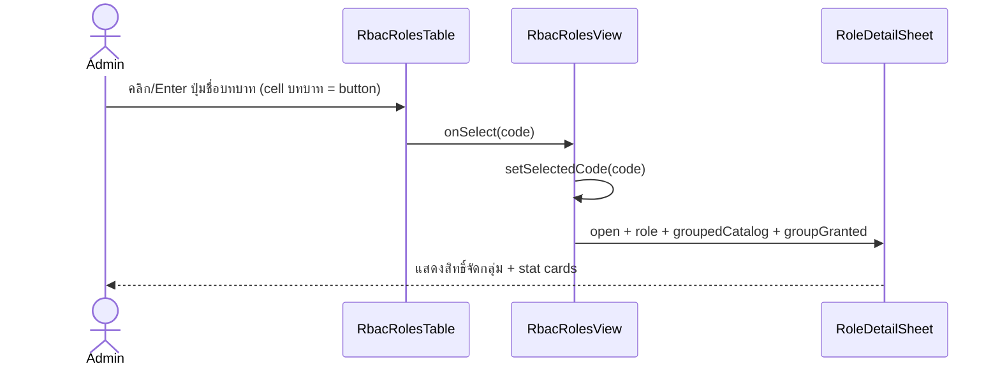
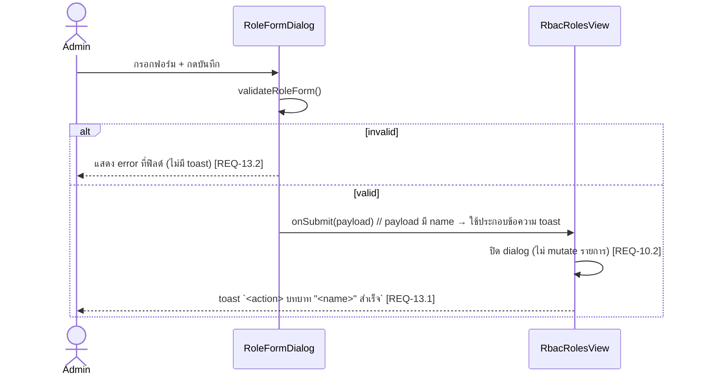

# Design: User RBAC Module

> Status: approved 2026-06-17

อ้างอิง: `requirements.md` (REQ-1..13, approved 2026-06-17), `ui-reference.md` (visual spec),
`.ai/shared/ARCHITECTURE.md`, `.ai/shared/CODING_STANDARDS.md`.

## Architecture Overview

โมดูล frontend-only, client-side, แยกขาดจาก User Management เดิม. โครงตาม data flow ของ repo:
`lib/mock/* (typed) -> pure selectors (lib/rbac/*) -> client container (state) -> presentational children (props)`.

### Routes (new, under `src/app/user/rbac/`) — REQ-2.1

- **ไม่สร้าง** `rbac/layout.tsx` — parent `src/app/user/layout.tsx` wrap `MinimalsLayout` ให้ทุก child
  ใต้ `/user` รวม `/user/rbac` อยู่แล้ว. สร้างซ้ำ = MinimalsLayout ซ้อนกัน (sidebar/topbar 2 ชั้น). [critique C1]
- `src/app/user/rbac/page.tsx` — Server Component: `metadata` + `<PageHeader title="บทบาทและสิทธิ์"
  breadcrumbs=[Console, บทบาทและสิทธิ์]>` (heading+breadcrumb เท่านั้น) + render `<RbacRolesView />`.

`PageHeader` (shared) มี props แค่ `{title, breadcrumbs, action:{label,href}}` — **ไม่มี subtitle** และ
`action` render เป็น `<Link href>` (navigate). ดังนั้น: subtitle REQ-3.2 และปุ่ม `+ เพิ่มบทบาทใหม่`
(REQ-6.1, ต้อง onClick เปิด Dialog ไม่ใช่ navigate) เป็นของ **`RbacRolesView` / `rbac-roles-toolbar`**
(client) — **ไม่ส่ง `action` ให้ PageHeader**. [critique C2]

ใช้ route เดียว `/user/rbac` — create/edit/duplicate/detail/delete ทำผ่าน Dialog/Sheet ใน client
(ไม่มี sub-route `/new` `/edit`). เหตุผล: ภาพ ui-reference แสดงทุกอย่างบนจอเดียว + drawer; UI-shell
ไม่ต้อง deep-link. (ปิด open question F6 รูปแบบฟอร์ม.)

### Components (new dir `src/components/rbac/`) — REQ-2.2/2.3/2.4

| ไฟล์ | ชนิด | หน้าที่ | REQ |
|------|------|---------|-----|
| `rbac-roles-view.tsx` | client container | ถือ state (search, selectedCode, dialog mode, toast); seed จาก mock; เดิน selectors; ส่ง props ลูก | 3,4,6-13 |
| `rbac-roles-table.tsx` | presentational | ตารางบทบาท (badge/คำอธิบาย/progress/users/actions) + empty/no-result. เปิด detail ผ่านปุ่มในคอลัมน์ `บทบาท` เป็น `<button>` (keyboard-reachable, focus เห็น) ไม่ใช่ onClick บน `<tr>`; ปุ่ม actions (แก้ไข/สำเนา/ลบ) `stopPropagation` แยกกัน | 3.3-3.9,11.1,12.3 |
| `rbac-role-badge.tsx` | presentational | จุดสี + ชื่อไทย ตาม `RoleColor` | 3.4,4.2 |
| `rbac-permission-progress.tsx` | presentational | `<Progress value={granted} max={total}>` + ป้าย `{granted}/{total}` | 3.5 |
| `rbac-role-detail-sheet.tsx` | presentational | `<Sheet side=right showCloseButton={false}>` + custom header (close/สำเนา/แก้ไข) + grouped perms + footer | 4.* |
| `rbac-role-form-dialog.tsx` | presentational | `<Dialog>` create/edit/duplicate + permission matrix + validation | 6,7,8 |
| `rbac-permission-matrix.tsx` | presentational | checkbox จัดกลุ่มตาม resource + เลือก/ยกเลิกทั้งกลุ่ม | 6.2 |
| `rbac-delete-dialog.tsx` | presentational | `<Dialog>` confirm ลบ (UI-shell) | 9.1 |
| `rbac-roles-toolbar.tsx` | presentational | subtitle `{N} บทบาท...` (REQ-3.2) + ช่องค้นหา (REQ-12) + ปุ่ม `+ เพิ่มบทบาทใหม่` (onClick เปิด form dialog) | 3.2,6.1,12 |
| `use-rbac-toast.ts` (ใน dir นี้) | hook | toast เล็ก local (ไม่มี dep ใหม่); `show(message)` ประกอบจาก action+ชื่อบทบาท — REQ-13 | 13 |

ห้าม import จาก `src/components/user/*` (REQ-2.4). ใช้ได้เฉพาะ shared primitive: `components/ui/*`
(`sheet`,`dialog`,`progress`,`badge`,`button`,`input`,`select`,`textarea`,`checkbox`,`label`,
`card`,`table`,`tooltip`,`separator`,`scroll-area`), `components/shared/page-header`, lucide-react.

### Pure logic (new dir `src/lib/rbac/`) — testable, ไม่มี UI

`role-permissions.ts` — selectors บริสุทธิ์ (no React, no side-effect):

- `grantedCount(permissions, catalog)` → จำนวน key ของ role ที่อยู่ใน catalog (REQ-5.5: ตัด key เถื่อนทิ้ง)
- `groupedCatalog(catalog, groups)` → `{ group, permissions }[]` เรียงตาม group order
- `groupGranted(role, group, catalog)` → `{ granted, total }` ต่อ resource group (REQ-4.4)
- `filterRoles(roles, query)` → กรอง name/code/description, case-insensitive (REQ-12.2)
- `isRoleDeletable(role)` → `role.userCount === 0` (REQ-9)
- `makeCopyCode(srcCode, existingCodes)` → `${srcCode}_copy`, ถ้าซ้ำต่อ `_copy2,3...` (REQ-8.1)
- `validateRoleForm(input, existingCodes, mode)` → `{ field: message }` (REQ-6.4/6.5/7.4)

`mode: "create" | "edit" | "duplicate"`. create/duplicate เช็ค code ซ้ำ; edit ไม่เช็ค code (read-only).

## Sequence Diagrams

### เปิด detail drawer (REQ-4.1)


### สร้าง/แก้ไข (UI-shell) — REQ-6/7/10/13


### ลบ + guard — REQ-9
```mermaid
sequenceDiagram
  actor U as Admin
  participant V as RbacRolesView
  participant C as DeleteDialog
  U->>V: กดลบ (เฉพาะเมื่อ userCount===0; >0 ปุ่ม disabled) [REQ-9.3]
  V->>C: open confirm
  U->>C: ยืนยัน
  C->>V: onConfirm
  V->>V: ปิด sheet/dialog (ไม่ลบจริง) [REQ-10.2]
  V-->>U: toast สำเร็จ [REQ-13.1]
```

## Data Models & Interfaces

### `src/types/rbac.ts` (PascalCase types)
```ts
export type ResourceKey = "txn" | "merchant" | "finance" | "user" | "system";
export type RoleColor = "red" | "blue" | "green" | "amber" | "gray";

export interface ResourceGroup {
  key: ResourceKey;
  label: string;            // ธุรกรรม / ร้านค้า / การเงิน / ผู้ใช้งาน / ระบบ
}

export interface Permission {
  key: string;              // `${resource}.${action}` เช่น "txn.view"
  label: string;            // ไทย
  resource: ResourceKey;
}

export interface Role {
  code: string;             // identity, immutable หลังสร้าง (REQ-7.3)
  name: string;             // ไทย
  description: string;
  color: RoleColor;
  permissions: string[];    // subset ของ catalog key (REQ-5.4)
  userCount: number;        // seed คงที่ (read-only mock, REQ-10)
}

export type RoleFormMode = "create" | "edit" | "duplicate";
export interface RoleFormInput {
  code: string;
  name: string;
  description: string;
  color: RoleColor;
  permissions: string[];
}
```

### `src/lib/mock/rbac.ts` (typed mock — single source ของ seed)

Resource groups (5): `txn` ธุรกรรม · `merchant` ร้านค้า · `finance` การเงิน · `user` ผู้ใช้งาน · `system` ระบบ.

Permission catalog (14 — ปิด open question จำนวน; denominator REQ-3.5/4.3 = `catalog.length` = 14):

| key | label | resource |
|-----|-------|----------|
| txn.view | ดูรายการธุรกรรม | txn |
| txn.refund | สั่งคืนเงิน | txn |
| txn.export | ส่งออกข้อมูลธุรกรรม | txn |
| merchant.view | ดูข้อมูลร้านค้า | merchant |
| merchant.manage | เพิ่ม/แก้ไข/ระงับร้านค้า | merchant |
| invoice.view | ดูใบแจ้งหนี้ | finance |
| invoice.manage | ออก/ยกเลิกใบแจ้งหนี้ | finance |
| settlement.run | สั่ง Settlement รอบพิเศษ | finance |
| user.view | ดูรายชื่อผู้ใช้งาน | user |
| user.manage | เปิด/แก้ไข/ปิดบัญชีผู้ใช้ | user |
| user.roles | กำหนดบทบาทให้ผู้ใช้ | user |
| audit.view | ดูบันทึกกิจกรรม (audit) | system |
| settings.manage | ตั้งค่าระบบและความปลอดภัย | system |
| apikey.manage | จัดการ API client / secret | system |

Seed roles (5 — granted ตรงกับ ui-reference):

| code | name | color | userCount | permissions (granted) |
|------|------|-------|-----------|------------------------|
| super_admin | ผู้ดูแลระบบสูงสุด | red | 1 | ทั้ง 14 (14/14) |
| ops_admin | ผู้ดูแลฝ่ายปฏิบัติการ | blue | 2 | txn.view, txn.refund, txn.export, merchant.view, merchant.manage, user.view (6/14) |
| finance | ผู้ดูแลการเงิน | green | 2 | txn.view, txn.export, invoice.view, invoice.manage, settlement.run (5/14) |
| support | เจ้าหน้าที่ซัพพอร์ต | amber | 2 | txn.view, merchant.view, user.view (3/14) |
| auditor | ผู้ตรวจสอบ | gray | 1 | txn.view, invoice.view, audit.view (3/14) |

### สี badge → semantic token (mirror `user-table-columns.tsx` idiom)
```ts
const roleColorStyles: Record<RoleColor, { dot: string; chip: string }> = {
  red:   { dot: "bg-error",   chip: "bg-error/16 text-error-dark" },
  blue:  { dot: "bg-info",    chip: "bg-info/16 text-info-dark" },
  green: { dot: "bg-success", chip: "bg-success/16 text-success-dark" },
  amber: { dot: "bg-warning", chip: "bg-warning/16 text-warning-dark" },
  gray:  { dot: "bg-grey-500",chip: "bg-grey-500/16 text-grey-600" },
};
```
สีไม่ใช่ตัวสื่อความหมายเดียว — มีชื่อ+รหัสกำกับเสมอ (REQ-11.3).

### Nav menu (REQ-1) — เพิ่มใน **ทั้งสอง** config
เพิ่ม item ต่อท้าย `ผู้ใช้งาน` ใน group `ผู้ใช้งาน & สิทธิ์` ของ **`nav-config.ts` (sidebar/vertical) และ
`minimals-nav-config.ts` (horizontal)** — มิฉะนั้นเมนูหายเมื่อสลับ layout (REQ-1.1 ครอบทั้งสอง). [critique C3]
```ts
{ title: "บทบาทและสิทธิ์", path: "/user/rbac", icon: "lock", match: "/user/rbac" }
```
icon = `ic-lock.svg` (มีอยู่แล้วใน `public/assets/icons/navbar/`).

## Technology Decisions

- **Route เดียว + Dialog/Sheet** แทน sub-route — ตรงภาพ, UI-shell ไม่ต้อง deep-link, แยกไฟล์ชัด.
- **ใช้ primitive เดิมทั้งหมด** (`sheet`,`dialog`,`progress`,`badge`,`table`...) — ไม่เพิ่ม dependency.
- **Toast local** (`use-rbac-toast.ts`): repo ไม่มี toast lib (ไม่มี sonner). สร้าง hook เล็ก
  (state array + auto-dismiss timeout + fixed container) ภายในโมดูล — เลี่ยงเพิ่ม dep (Dependency rules).
- **Roles table = custom (`table.tsx` primitive) ไม่ใช้ `@tanstack/react-table`/`DataTable`** —
  รายการเล็ก, layout เฉพาะ (badge เหนือ code, progress, row-click เปิด sheet), search ง่ายผ่าน
  `filterRoles`. ลดความซับซ้อนเทียบ DataTable (selection/pagination ไม่ต้องใช้).
- **Pure selectors แยก `src/lib/rbac/`** — logic คำนวณ/validate ออกจาก view (ARCHITECTURE).
- **ไม่เพิ่ม test runner**: repo ไม่มี script `test`/`typecheck` (มีแค่ `dev`/`build`); เพิ่ม vitest =
  new dep ต้องอนุมัติ. ดู Testing Strategy.

### Decision D1 (ต้องการอนุมัติ) — active-menu ชนกัน (เฉพาะ sidebar/vertical)
`sidebar-nav.tsx:isActivePath` ใช้ `base = match ?? path` แล้ว active เมื่อ `pathname.startsWith(base+"/")`.
`ผู้ใช้งาน` มี `match:"/user"` → บน `/user/rbac` มันจะ active ด้วย (เพราะ `/user/rbac`.startsWith(`/user/`)).
ผลคือ **ทั้ง `ผู้ใช้งาน` และ `บทบาทและสิทธิ์` ติดสว่างพร้อมกัน** บนหน้า rbac — ขัด REQ-1.3 vs REQ-1.4.

ขอบเขตจริง (จาก critique C3):
- เกิด **เฉพาะ `sidebar-nav.tsx`**. `minimals-horizontal-nav.tsx` ใช้ `minimalsNavConfig` และ `isActive`
  เทียบจาก `item.path` (`/user/list`) **ไม่ใช้ `match`** → `/user/rbac` ไม่ทำให้ `ผู้ใช้งาน` สว่าง. horizontal
  ต้องการแค่ "เพิ่ม nav item" ไม่ต้องแก้ logic.
- `sidebar-nav.tsx` เรียก `isActivePath` ต่อ-item เอกเทศ (ไม่มีจุดเห็นทั้งกลุ่มพร้อมกัน) → "longest-base-wins"
  ต้อง refactor ระดับ list/group ใน `SidebarNav.navContent` ไม่ใช่แก้บรรทัดเดียวใน `isActivePath`.

ตัวเลือก:
- **D1-C (แนะนำ) exclude list**: เพิ่ม optional `exclude?: string[]` ใน `NavItem`; ใน `isActivePath` ข้าม
  deep-match ถ้า `pathname` ขึ้นต้นด้วย prefix ใน `exclude`; ใส่ `exclude:["/user/rbac"]` ที่ item `ผู้ใช้งาน`.
  contained สุด (type +1 field, logic +1 guard, config +1 field). `ผู้ใช้งาน` ยัง active บนหน้าตัวเองครบ
  (`/user/list,new,edit,read`) — REQ-1.4 คง behaviour, แค่กันไม่ให้ล้นมา rbac.
- **D1-A longest-base-wins**: refactor `SidebarNav.navContent` ให้เลือก active item ที่ base ยาวสุดต่อกลุ่ม.
  ถูกต้องทั่วไปกว่าแต่ scope ใหญ่กว่า (แก้ render path, ไม่ใช่ guard เดียว).
- **D1-B zero-touch**: ไม่แก้ logic — ยอมรับ dual-highlight บนหน้า rbac.

> ค่าเริ่ม implement = **D1-C** เว้นแต่สั่งเปลี่ยน. ไม่ว่าเลือกข้อใด ต้องเพิ่ม nav item ใน **ทั้งสอง** config เสมอ.

## Error Handling Strategy

| กรณี | การจัดการ | REQ |
|------|-----------|-----|
| ชื่อบทบาทว่าง (create/edit) | block save, error ใต้ field ชื่อ, ไม่ toast | 6.4,7.4,13.2 |
| รหัสบทบาทว่าง (create/duplicate) | block save, error ใต้ field code | 6.4 |
| รหัสซ้ำ (create/duplicate) | block save, error "รหัสนี้ถูกใช้แล้ว" | 6.5,8.1 |
| ลบบทบาทที่ userCount>0 | ปุ่มลบ disabled + tooltip เหตุผล | 9.2,9.3 |
| role อ้าง key นอก catalog | `grantedCount` ตัดทิ้ง, ไม่ render, ไม่ crash | 5.5 |
| ค้นหาไม่เจอ | no-result state แทนแถว | 12.3 |
| ไม่มีบทบาทเลย | empty state | 3.9 |

## Testing Strategy

repo ไม่มี test runner/typecheck script → automated unit test ยัง **ไม่ผูกใน gate** (gate-task.sh เหลือ
Evidence-only). แผน:

- **Pure selectors เขียนแบบ test-ready** (export, no side-effect) ใน `src/lib/rbac/role-permissions.ts`
  เพื่อให้เพิ่ม test ได้ทันทีเมื่ออนุมัติ runner. หากอนุมัติ vitez/vitest → co-locate
  `role-permissions.test.ts` คลุม: grantedCount (ตัด key เถื่อน REQ-5.5), groupGranted (REQ-4.4),
  filterRoles (REQ-12.2), isRoleDeletable (REQ-9), makeCopyCode ชนซ้ำ (REQ-8.1), validateRoleForm ทุก mode
  (REQ-6.4/6.5/7.3/7.4).
- **Typecheck**: `next build` (Next ทำ type check) เป็น proxy code-green.
- **Manual acceptance walkthrough** ต่อ REQ (รันแอป `npm run dev` :5200): nav active (D1), list/subtitle/footer
  (REQ-3), drawer grouped perms (REQ-4), create/edit/duplicate validation + UI-shell no-mutate (REQ-6/7/8/10),
  delete guard (REQ-9), search/no-result (REQ-12), toast (REQ-13), keyboard/focus (REQ-11).

> ขออนุมัติแยก: จะเพิ่ม `vitest` (+`@testing-library` ไม่ต้อง เพราะ test เฉพาะ pure fn) เป็น devDependency
> ไหม? ถ้าไม่ → unit test ถูกข้าม, เหลือ typecheck + manual.

## Requirement Traceability

| Design element | REQ |
|----------------|-----|
| nav-config item + D1 active fix | REQ-1.1,1.2,1.3,1.4 |
| route `app/user/rbac/*` + dir `components/rbac/`, `lib/rbac/`, no user/* import | REQ-2.1,2.2,2.3,2.4 |
| `rbac-roles-view` + `rbac-roles-table` + `rbac-roles-toolbar` | REQ-3.1-3.9 |
| `rbac-role-badge` | REQ-3.4,11.3 |
| `rbac-permission-progress` + `grantedCount` | REQ-3.5 |
| `rbac-role-detail-sheet` + `groupGranted`/`groupedCatalog` | REQ-4.1-4.7 |
| `types/rbac.ts` + `lib/mock/rbac.ts` catalog | REQ-5.1-5.5 |
| `rbac-role-form-dialog` + `rbac-permission-matrix` + `validateRoleForm` | REQ-6.1-6.6,7.1-7.5,8.1-8.2 |
| `makeCopyCode` | REQ-8.1 |
| `rbac-delete-dialog` + `isRoleDeletable` | REQ-9.1-9.4 |
| UI-shell wiring ใน `rbac-roles-view` + seed mock | REQ-10.1-10.3 |
| focus/aria/contrast ทุก interactive | REQ-11.1-11.3 |
| `rbac-roles-toolbar` search + `filterRoles` | REQ-12.1-12.4 |
| `use-rbac-toast` | REQ-13.1-13.2 |

## Invariants (กัน reviewer สับสน UI-shell)
- subtitle `{N} บทบาท` : `N = RBAC_ROLES.length` (seed คงที่) — ไม่เปลี่ยนตาม CRUD (REQ-10) หรือ filter
  (REQ-12.4). ตาราง render จาก seed เสมอ; search กรองเฉพาะ "view" ไม่แตะ source.
- toast (REQ-13) = feedback ล้วน ไม่แตะ data; delete confirm/save ปิด dialog แล้วโชว์ toast โดยไม่ mutate.

## Open Decisions — RESOLVED (gate 2026-06-17)
1. D1 active-menu = **C (exclude list)** — เพิ่ม `exclude?:string[]` ใน `NavItem`, guard ใน `isActivePath`,
   ใส่ `exclude:["/user/rbac"]` ที่ item `ผู้ใช้งาน`. เพิ่ม nav item ทั้งสอง config.
2. Unit test = **ไม่เพิ่ม vitest** — selectors เขียน test-ready, verify ผ่าน `next build` (typecheck) + manual
   acceptance walkthrough. ไม่เพิ่ม devDependency.

## Critique log (spec-architect, 2026-06-17)
- C1 double-wrap layout → แก้: ไม่สร้าง `rbac/layout.tsx`.
- C2 PageHeader ไม่มี subtitle/onClick-action → แก้: subtitle+ปุ่ม add อยู่ใน toolbar (client), PageHeader ไม่ส่ง action.
- C3 D1 วิเคราะห์ horizontal nav ผิด + scope → แก้: เพิ่ม item ทั้งสอง config; D1 เกิดเฉพาะ sidebar; เปลี่ยนค่าเริ่มเป็น D1-C.
- M1 Progress ต้องมี max → แก้: `value={granted} max={total}`.
- M2 Sheet close ปุ่มชน → แก้: `showCloseButton={false}` + custom header.
- M3 row keyboard → แก้: cell บทบาท = `<button>`, actions stopPropagation.
- M4 toast ต้องมีชื่อบทบาท → แก้: payload ส่ง name ประกอบข้อความ.
- m1 seed counts ตรวจผ่าน (14/6/5/3/3). m2 `user.roles` = design choice (ภาพตัด). m3/m4 token/ไม่ขัดแย้ง — เพิ่ม Invariants ชี้แจง.
